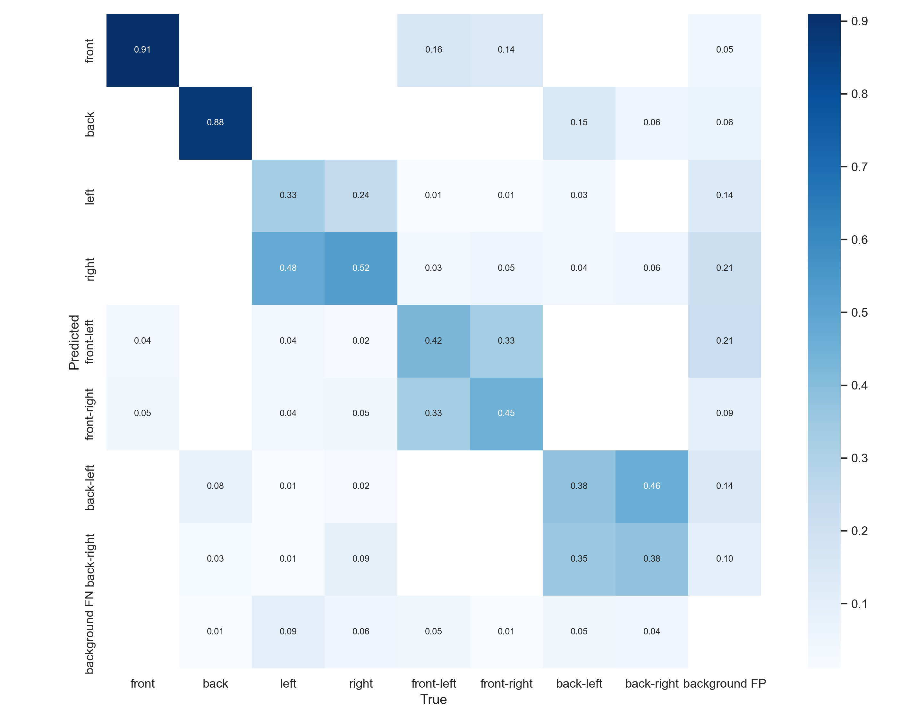
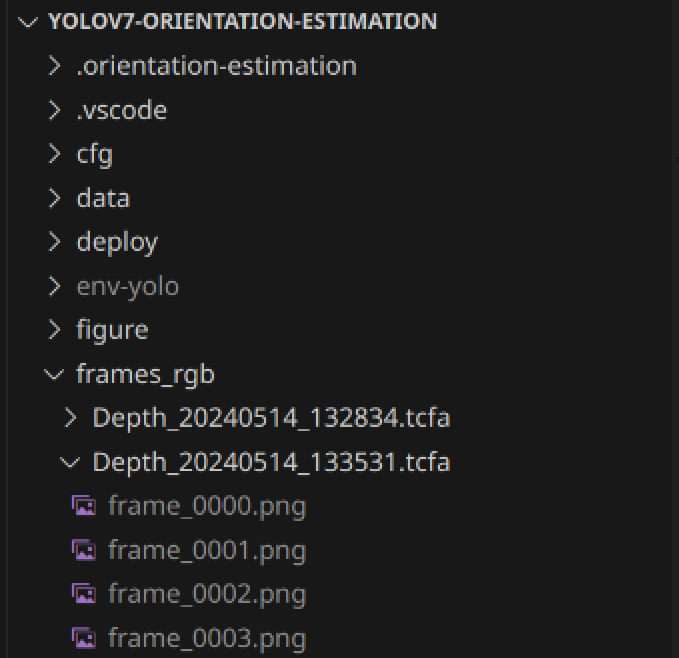
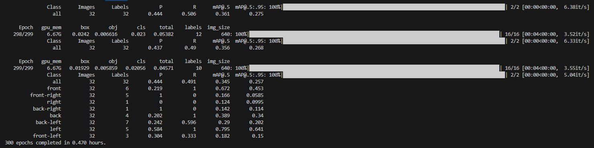
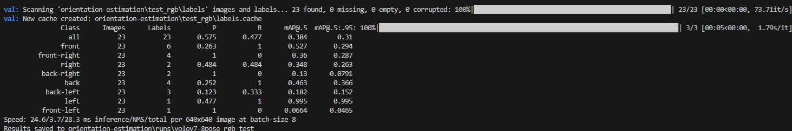

# Orientation-Estimation mit YoloV7

## Anleitung zur Nutzung

Im Folgenden wird zu Anschauungszwecken nur ein Datensatz mit etwa 250 Bildern und Label benutzt. \
Beim vollständigen Datensatz mit etwa knapp 4000 Bildern erreicht man nach 300 Trainingsepochen 0.9 Precision und Recall (Overfitting).



### Vorraussetzungen

- Python 3.11 muss installiert sein und genutzt werden
- Anleitung bezieht sich auf **Linux** Installation
- im besten Fall eine Nvidia Grafikkarte mit 8+ GB Vram \
-> alternativ statt "--device 0" immer "--device cpu" angeben


### Python Environment initialisieren
1. Ins root-directory dieses Repositories navigieren
2. ```mkdir env-yolo```
3. ```python3.11 -m venv env-yolo```
4. ```source env-yolo/bin/activate```
5. ```pip install --upgrade setuptools```
6. ```pip install -r requirements.txt```
7. ```pip install torch torchvision torchaudio``` \
Oder, falls später beim Training Probleme / Abstürze wegen Cuda auftreten \
**(Alternativ)**:
8. ```pip uninstall torch torchvision torchaudio```
9. ```pip install torch torchvision torchaudio --index-url https://download.pytorch.org/whl/cu118```

### Label erstellen

1. Ins Root-Verzeichnis des Repositories navigieren.
2. Fotos, die mittels depthimage_converter extrahiert wurden, in frames_rgb ablegen. \
-> Ablage in Ordnern wie aus der depthimage_converter.py Ausgabe -> Copy-Paste \

3. yolov7.pt (auf den COCO MS Datensatz vortrainierte Gewichte) muss im root directory liegen (in diesem Repo enthalten)
4. ```python extractbb.py --device 0``` \
-> Bounding boxes werden in orientation-estimation/boundingboxes/frames_rgb abgelegt.
6. Label Datei (.csv) in Orientation_estimation ablegen -> orientation_estimation/labels.csv .
7. ```python orientation-estimation/create_labels.py``` \
-> Label-Dateien werden in orientation-estimation/labels erstellt.
9. ```python orientation-estimation/split.py``` \
Damit wird der Datensatz in 70% Trainingsdaten, 20% Evaluierungsdaten und 10% Testdaten aufgeteilt. \
Die Label und Bilddateien werden wie für YoloV7 benötig in den Ordnern orientation-estimation/train_rgb, orientation-estimation/val_rgb und orientation-estimation/test_rgb abgelegt. \
Diese Ordnerstruktur wird in der Datei orientation-estimation/pose-training_rgb.yaml festgelegt. In den jeweiligen Ordnern muss sich ein Unterordner "labels" und "images" befinden.
10. ```python train.py --workers 8 --device 0 --batch-size 8 --data ./orientation-estimation/pose-training_rgb.yaml --img 640 640 --cfg ./orientation-estimation/yolov7-pose.yaml --weights '' --name yolov7-8pose_rgb --hyp data/hyp.scratch.custom.yaml --project orientation-estimation/runs --epochs 300``` \
In orientation-estimation/runs/lov7-8pose_rgb werden die Ergebnisse gespeichert, darunter die erzeugten Gewichte. 

11. Um die Gewichte dann auf einen anderen Datensatz zu testen gibt es die "orientation-estimation/pose-training_rgb_test.yaml" . \
In dieser werden die erzeugten Testdaten verlinkt.
Mit diesem die trainierten Gewichte testen: \
```python test.py --data orientation-estimation/pose-training_rgb_test.yaml --img 640 --batch 8 --conf 0.001 --iou 0.65 --device 0 --weights orientation-estimation/runs/yolov7-8pose_rgb/weights/best.pt --name yolov7-8pose_rgb_test --project orientation-estimation/runs``` \
Im Ordner orientation-estimation/runs/lov7-8pose_rgb_test finden sich die Ergebnisse des Testlaufs.

12. **ALTERNATIV**
    Um mithilfe von vortrainierten Gewichten zu testen (auf Session 2, etwa 3300 Fotos) kann folgender Befehl genutzt werden:
    ```python test.py --data orientation-estimation/pose-training_rgb_test_pretrained.yaml --img 640 --batch 8 --conf 0.001 --iou 0.65 --device 0 --weights orientation-estimation/pretrained-pose.pt --name yolov7-8pose_rgb_test_pretrained --project orientation-estimation/runs```

## Variationen im Training

### Transfer Learning

Alternativ zum Trainieren von 0 auf, kann mit "--weights XXX" bereits gelernte Gewichte umtrainiert werden. \
Außerdem kann so ein Trainingslauf weitergeführt werden, falls der vorherige abbrach. \
Bestehende Gewichte:
- COCO MS (yolov7.pt)
- Transfer Learning Gewichte vorgegeben (yolov7_training.pt)
- YOLOV7 Pose Estimation (2D) Gewichte (yolov7-w6-pose.pt)

Mit yolov7.pt und yolov7_training.pt sind die Ergebnisse früher besser geworden, das Endergebnis aber nicht. \
Man spart sich etwa 30 Epochen Training (bei unserem Trainingsdatensatz 2 mit etwa 3300 Bildern).

### Bildgröße

Nur mit 640x640 getestet.
Entspricht Yolo Preset bei P5 Hyperparametern.

P6 Hyperparameter auf 1280x1280 abgestimmt.
Nicht getestet aufgrund von Zeit- und Ressourcenmangel.

Sehr ressourcenaufwändig, wird aber definitiv die Ergebnisse weiter verbessern!

### Hyperparameter 

- P5 (640x640)
- P6 (1280x128)
- Custom 
- Tiny

Ergebnisse mit allen Hyperparameter beim Trainieren gleich (Validierung anhand Daten aus gleichen Aufnahmesequenzen). \
Tests auf einen komplett neuen Datensatz mit anderen Personen, Hintergründen, Sequenzen zeigten verwunderlicherweiße, dass die "Custom" Hyperparameter klar besser sind (+0.2 Precision gegenüber den anderen Hyperparametern).

### Batch-Size
Statt der empfohlenen Batch-Size von 32 habe ich mit 8 trainiert, so dass der Vram meiner Grafikkarte nicht überlastet ist. \
Danach greift das System nämlich auf normalen RAM zu und das Training wird unglaublich langsam (Faktor ~5-10).

Die Ergebnisse bei der niedrigen Batch-Size sind trotzdem genauso gut, es dauert nur länger - mehr Epochen.
Dies zeigten meine Versuche sowie folgende [Quelle](https://github.com/ultralytics/yolov5/discussions/2452).